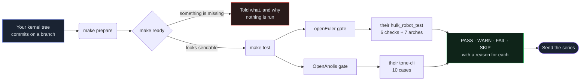

<div align="center">



<br>

**Find out what openEuler's and OpenAnolis's CI will say about your kernel series — before you post it.**

Pre-PR CI runs the distributions' *own* gate scripts, from their *own*
repositories, against your tree. Not a reimplementation that drifts: their
code, pinned as submodules, driven through one interface.

<br>

[](LICENSE)
[](https://www.python.org/)
[](web/tests/test_prci.py)
[](#-the-gates)

[Quick start](#-quick-start) &nbsp;·&nbsp;
[The gates](#-the-gates) &nbsp;·&nbsp;
[Web interface](#-web-interface) &nbsp;·&nbsp;
[Commands](#-commands) &nbsp;·&nbsp;
[Docs](DOCUMENT.md)

</div>

---

## 💡 Why

A kernel series that fails a distribution's CI costs a round trip: post, wait
for the robot, read a terse failure, fix, repost. The checks are not secret —
openEuler publishes `hulk_robot_test`, OpenAnolis publishes `tone-cli` — but
running them by hand means reproducing an environment, a branch matrix and a
verdict convention for each one.

This tool does that part. It clones their check scripts, feeds them your
patches the way their CI would, and reports what they reported, in their
words:

<table>
<tr>
<td width="50%" valign="top">

**What it does not do**

- Reimplement their checks in our own style
- Guess at their pass/fail rules
- Hardcode their branch or architecture matrix
- Pretend a check ran when it was skipped

</td>
<td width="50%" valign="top">

**What it does**

- Vendor their repositories as pinned submodules
- Read their config (`check_build.yaml`, their caselists)
- Reproduce their verdict — including `WARNING`, which is neither pass nor fail
- Say *why* when a check is skipped or reported green without compiling

</td>
</tr>
</table>

---

## 🚀 Quick start

```bash
# Their check scripts are submodules. Cloning without them leaves
# check_kapi, checkkabi and the RPM builds failing on empty directories.
git clone --recurse-submodules https://github.com/SelamHemanth/pre-pr-ci.git
cd pre-pr-ci

# Already cloned flat?
git submodule update --init --recursive

make config      # pick your distribution and point it at your kernel tree
make prepare     # shape the patches the way their CI expects
make ready       # "are these actually ready?" — before burning an hour
make test        # run the gate
```

Prefer a browser? `pip3 install --user -r web/requirements.txt && python3 web/server.py`,
then open `http://localhost:5000`.

---

## 🔀 How it flows



---

## 🎯 The gates

Names below are **theirs**, not ours: the left column is what their scripts
dispatch on, and it is what you will see in their CI comment when the series
lands.

<details open>
<summary><b>&nbsp;🐉&nbsp; openEuler &nbsp;—&nbsp; <code>hulk_robot_test</code>, 6 checks + 7 architectures</b></summary>

<br>

| Check | What it rejects |
|---|---|
| `checkpatch` | Style, via their `checkpatch.pl` invocation — backports matching upstream are skipped, as theirs are |
| `checkformat` | A missing inclusion header, category, bugzilla link or sign-off |
| `checkdepend` | Upstream commits that fix yours and are not in the series |
| `checkkabi` | Changes to structures and symbols modules were built against |
| `checkconflict` | A commit differing from upstream that does not say which files differ |
| `checkbinary` | Binary files added or changed by the series |

Then `check_build`, per architecture, from **their** `conf/check_build.yaml`
rather than a list we typed out:

`aarch64` · `x86_64` · `arm` · `PPC` · `ppc64` · `riscv64` · `loongarch`

> [!NOTE]
> `loongarch` is reported **green without compiling**, and the report says
> so. Their `checkbuild.sh` exits `0` above the compile step when the branch
> has the architecture switched off, and their job finishes `SUCCESS`. We
> report what they report, and explain it, rather than inventing a skip they
> never showed you.

</details>

<details>
<summary><b>&nbsp;🐲&nbsp; OpenAnolis &nbsp;—&nbsp; <code>tone-cli</code>, 10 cases</b></summary>

<br>

| Case | Their report shows | What it covers |
|---|---|---|
| `check_kconfig` | `check_Kconfig` | New config symbols are declared and reachable |
| `build_allyes_config` | `allyesconfig` | Code no normal config ever compiles |
| `build_allno_config` | `allnoconfig` | Code that only builds because something else was on |
| `build_anolis_defconfig` | `anolis_defconfig` | The configuration OpenAnolis actually ships |
| `build_anolis_debug` | `anolis-debug_defconfig` | The debugging checks turned on |
| `anck_rpm_build` | `build_rpm` | The ANCK RPMs, the form the kernel is delivered in |
| `build_perf` | `build_perf` | `perf`, which breaks on header changes the kernel build misses |
| `boot_kernel_rpm` | `boot_kernel_rpm` | The kernel installs in a VM and comes up |
| `check_kapi` | `check_kapi` | The booted kernel's ABI against their `kabi-whitelist` baseline |
| `check_dmesg` | `check_dmesg` | The booted kernel's log, minus the noise their ignore list covers |

> [!IMPORTANT]
> The last three are **one suite, not three**. Their `anck-ci-test` runs
> `install_rpm → reboot → run_case` and reports all three from the booted
> machine, so ours runs it once on a VM you supply (`VM_IP`, `VM_ROOT_PWD`)
> and reads one row per test. Running it on your workstation would be reading
> *your* kernel, which has nothing to do with the series.

</details>

<details>
<summary><b>&nbsp;🚧&nbsp; OpenCloud &nbsp;—&nbsp; not implemented yet</b></summary>

<br>

`make config` detects OpenCloudOS hosts, but there is no gate behind it yet:
no vendored check scripts, no cases, nothing in the registry. It is listed
here so nobody configures it expecting a run.

</details>

---

## 🚦 Four verdicts, not two

Their scripts have four, and collapsing them loses the answer:

<div align="center">

| | Verdict | Means |
|:--:|---|---|
| 🟢 | **PASS** | Their check ran and was satisfied |
| 🟡 | **WARN** | Their check flagged something but did **not** reject the series |
| 🔴 | **FAIL** | Their gate would reject this |
| ⚪ | **SKIP** | It could not run, and the report says what was missing |

</div>

Folding `WARN` into pass hides something they flagged; folding it into fail
rejects a series they would have let through. `checkkabi` and `checkconflict`
are warnings in openEuler's own status table — even where the prose beneath
that table says "FAILED".

---

## 🌐 Web interface

```bash
pip3 install --user -r web/requirements.txt
python3 web/server.py                 # http://localhost:5000
python3 web/server.py --host 0.0.0.0  # reachable from elsewhere — read the warning
```

- 🎛️ &nbsp;Configure, prepare and run without touching a shell
- 📡 &nbsp;Live log streaming over a websocket, in the verdict colours above
- 🕓 &nbsp;Job history that survives a restart
- 🖥️ &nbsp;An embedded terminal on the build host
- 🌓 &nbsp;Light and dark themes
- 📴 &nbsp;Vue and xterm.js are vendored, so it **works with no route to the internet**

> [!CAUTION]
> **There is no authentication, and the terminal tab is a real shell on the
> build machine.** Anyone who can reach the port has that shell. Keep it on a
> network you trust, or bind it to loopback and tunnel in:
> ```bash
> python3 web/server.py --host 127.0.0.1
> ssh -L 5000:127.0.0.1:5000 you@buildhost
> ```

Run it as a systemd service:
`sudo ./service.sh install|start|stop|restart|status|logs|uninstall`.

---

## 📟 Commands

| Getting set up | |
|---|---|
| `make config` | Choose the distribution, point it at your tree |
| `make update-tests` | Change which checks are enabled |
| `make list-tests` | What the configured distro will run |
| `make update` | Pull a newer version of this tool |

| Running the gate | |
|---|---|
| `make prepare` | Shape the patches for their CI |
| `make ready` | Are they actually sendable? |
| `make test` | Run everything enabled |
| `make euler-test=<name>` | One openEuler check |
| `make anolis-test=<name>` | One OpenAnolis case |

| Cleaning up | |
|---|---|
| `make clean` | Remove `logs/` and `outputs/` |
| `make reset` | Return the kernel tree to its saved HEAD |
| `make distclean` | Remove every artifact and config |

---

## 📦 What is vendored

Their code, pinned. A submodule that drifts is a gate that no longer matches
the one you will face, so these are pinned deliberately and updated on
purpose:

| Submodule | From | Why |
|---|---|---|
| `euler/hulk_robot_test` | gitcode.com/hulk-robot | openEuler's check scripts |
| `euler/kernel` | atomgit.com/src-openeuler | Their kernel spec files |
| `anolis/tone-cli` | gitee.com/anolis | OpenAnolis's test suites *(shallow)* |
| `anolis/kabi-dw` | gitee.com/anolis | The ABI comparison tool their `check_kapi` uses |
| `anolis/kabi-whitelist` | gitee.com/anolis | Their ABI baselines, per branch |

---

## 🧪 Development

```bash
python3 -m unittest discover -s web/tests -p 'test_*.py'
```

166 tests. A good share of them are *guards* rather than unit tests: they
assert that our registry, `test.sh`, the Jenkins pipeline and the docs all
still agree, and that what we claim about the distributions still matches
what is in their vendored code. When a rename or a rule change slips through
one of those layers, the guard is what catches it.

---

## 📖 Documentation · 📄 License · 👤 Author

Full setup, troubleshooting and per-test detail: **[DOCUMENT.md](DOCUMENT.md)**

Licensed under **[GPL-3.0](LICENSE)**.

**Hemanth Selam** — [@SelamHemanth](https://github.com/SelamHemanth) ·
[Hemanth.Selam@amd.com](mailto:Hemanth.Selam@amd.com)

<div align="center">
<br>
<sub>Contributions welcome — fork, branch, and open a PR.</sub>
<br><br>

</div>
